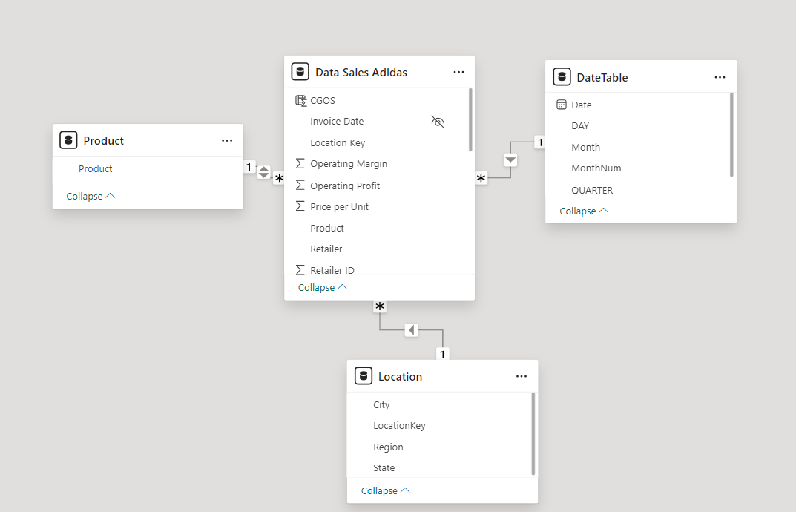

# ADIDAS SALES ANALYSIS

## INTRODUCTION
In this project, I analyze **Adidas sales** data to uncover trends, patterns, and insights that could inform business decisions and strategies. Leveraging my skills in data cleaning, visualization, and analysis, I explore key metrics such as sales revenue, product performance, regional variations, and Monthly impacts on sales.

**_Objectives_**
The main objectives of this analysis are to:

Identify top-performing products and categories
Analyze sales trends across different regions and Seasonal fluatuation 
Provide actionable insights that could drive sales growth
This project demonstrates my expertise in data analysis, visualization, and storytelling, using tools like SQL, Power BI, and Python to translate data into meaningful insights.

## PROBLEM STATEMENT

Adidas, as a leading global sportswear brand, continuously seeks to optimize its sales performance to maintain a competitive edge in a dynamic market. However, the vast range of products and varying consumer preferences across different regions and seasons present challenges in identifying clear trends and actionable insights.

The primary problem this analysis seeks to address is:

1. How can Adidas leverage sales data to pinpoint high-performing products, understand regional and seasonal sales patterns, and make data-driven decisions to enhance profitability?
By analyzing Adidas' historical sales data, this project aims to uncover insights that could:

2. Highlight best-selling products and underperforming items,
3. Reveal trends based on geography and seasonal fluctuations,
4. Provide recommendations for inventory and marketing adjustments.
Through this analysis, I aim to provide data-backed insights that can help inform Adidas' strategic planning and improve overall sales effectiveness.

## SKILLS
- Data Cleaning & Preparation: Used Python and SQL to clean, transform, and structure raw data for accurate analysis.
- Data Analysis: Applied statistical techniques and analytics to identify patterns and trends in sales data.
- Data Visualization: Leveraged Power BI and Python libraries (Matplotlib, Seaborn) to create interactive dashboards and charts for clear data storytelling.
- Exploratory Data Analysis (EDA): Performed EDA to uncover insights on product performance, regional sales variations, and seasonality.
- DAX (Data Analysis Expressions): Employed DAX formulas in Power BI to create custom calculations, measures, and columns. This allowed for in-depth analysis, such as year-over-year comparisons, cumulative sales, and percentage growth, enabling more insightful data interpretation. 
- Business Intelligence: Used Power BI to build dashboards that offer at-a-glance views of key performance indicators.
Problem-Solving: Analyzed business questions to guide decision-making with data-driven recommendations.
This combination of skills showcases my ability to extract, process, and interpret data effectively to provide meaningful business insights.

## MODELLING
Designed an optimized data model in Power BI by establishing relationships between tables and organizing data into fact and dimension tables. This structure enables efficient querying, accurate aggregations, and intuitive report navigation.

In this project, data modeling was essential for building a robust foundation for analysis. A well-structured model ensures seamless DAX calculations and improves the performance and accuracy of the Adidas sales analysis dashboards.

## VISUALIZATION
In this Adidas sales analysis, I prioritized creating compelling and intuitive visualizations to communicate data insights effectively. Using Power BI, I crafted interactive dashboards that allow users to explore:

Sales Performance by Region: Visualized sales data across various regions using heat maps, bar charts, and slicers for deeper geographic insights.
Product Category Trends: Implemented stacked column charts and line graphs to track product categories' sales performance over time, highlighting top categories and seasonal trends.
Key Performance Indicators (KPIs): Displayed crucial metrics such as total sales, average order value, and year-over-year growth using KPI cards, providing a quick snapshot of Adidas' performance.
Time-Based Analysis: Created line charts and area charts to analyze sales trends over different periods, showing seasonal effects and monthly performance variations.
These visualizations empower stakeholders to interact with the data, enabling more insightful exploration of patterns, trends, and opportunities. This project demonstrates my expertise in translating complex data into clear, actionable insights.

## INSIGHT

From the analysis of the Adidas dataset, here are a few insights gained:
Overall Performance:
- Strong Sales Growth: The total sales have increased significantly, indicating a positive trend.
- Profitability: The total profit has also grown, suggesting that the company is operating efficiently.
- Product Performance:
Men's Street Footwear Dominance: This product category is driving sales and profits, indicating a strong market fit.
- Sales Channel Analysis:
In-Store Sales Success: In-store sales are consistently outperforming other channels, suggesting a preference for physical stores.
- Regional Performance:
West Region Leadership: The West region is the top performer in terms of both sales and profit, indicating a strong market presence.
- Seasonal Trends:
Monthly Fluctuations: Sales and profit vary across different months, suggesting seasonal trends that could be further analyzed to optimize marketing and inventory strategies.

## Adittional Insight to explore
- Customer Segmentation: Analyzing customer data could help identify key customer segments and tailor marketing efforts accordingly.
- Product Mix Analysis: Evaluating the performance of different product categories can help optimize the product portfolio.
- Competitive Analysis: Comparing Adidas' performance to competitors can provide valuable insights into market trends and opportunities.
- By delving deeper into these areas, Adidas can gain a more comprehensive understanding of its business and make data-driven decisions to improve performance and achieve long-term success.

## Conclusion and Recommendations
The Adidas sales analysis provided essential insights into product performance, seasonal trends, and regional preferences, offering a data-driven foundation for strategic decision-making. Key findings include the identification of top-selling products, seasonal and geographic sales patterns, and insights into customer buying behavior.

## Recommendations
- To leverage these insights, I propose the following recommendations:

- Optimize Product Portfolio: Prioritize high-performing products and phase out or promote underperforming items to maximize revenue.

- Seasonal Campaigns: Launch targeted marketing efforts during peak seasons to capitalize on high-demand periods and enhance customer engagement. 🤓

- Region-Specific Strategies: Tailor sales and marketing approaches for different regions, focusing on high-potential markets and aligning product assortments with local preferences.

- Inventory Management: Use data-driven strategies to optimize inventory, ensuring availability of popular products while reducing overstock on slower-moving items.

- Customer Retention Programs: Introduce loyalty programs and personalized promotions based on customer purchase patterns to boost repeat purchases and strengthen customer loyalty.

- Pricing Adjustments: Implement strategic pricing for high-demand products to maximize profitability and consider discounts or bundles for less popular items.

Through this project, I demonstrated my ability to analyze, model, and visualize sales data to provide actionable insights. These recommendations aim to help Adidas enhance its sales performance, improve customer satisfaction, and support sustained growth in a competitive market.

